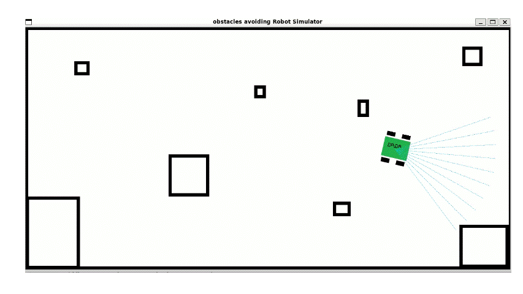

# Obstacles Avoiding Robot Simulator Project

This project simulates a robot navigating through an environment using Pygame. The robot can move, avoid obstacles, and update its position and heading based on sensor inputs.



## Table of Contents
- [Introduction](#introduction)
- [Features](#features)
- [Installation](#installation)
- [Usage](#usage)
- [Classes and Functions](#classes-and-functions)
- [Contributing](#contributing)
- [License](#license)

## Introduction

This project includes classes and functions for a robot simulator that involves robot movement, obstacle avoidance, sensor functionality, and graphics rendering using Pygame.

## Features

- **Robot Movement**: Simulates robot movement in a 2D space.
- **Obstacle Avoidance**: Detects and avoids obstacles using sensor inputs.
- **Graphics Rendering**: Renders the robot and environment using Pygame.
- **Sensor Functionality**: Uses ultrasonic sensors to detect obstacles.

## Installation

1. Clone the repository:
    ```sh
    git clone https://github.com/DadaNanjesha/robotics_project.git
    ```
2. Navigate to the project directory:
    ```sh
    cd robotics_project
    ```
3. Install the required dependencies:
    ```sh
    pip install -r requirements.txt
    ```

## Usage

1. Run the main simulation script:
    ```sh
    python main.py
    ```
2. The simulation window will open, showing the robot navigating through the environment.

## Classes and Functions

### [robot.py](http://_vscodecontentref_/1)

- **`point_distance(p1, p2)`**: Calculates the Euclidean distance between two points.
- **`Robot`**: Class representing the robot.
  - **`__init__(self, start_pos, width)`**: Initializes the robot with a starting position and width.
  - **`move(self, distance, angle)`**: Moves the robot by a certain distance and angle.
  - **`get_position(self)`**: Returns the current position of the robot.
  - **`get_heading(self)`**: Returns the current heading angle of the robot.
  - **`set_speed(self, vl, vr)`**: Sets the speed of the robot's wheels.
  - **`detect_obstacle(self, distance)`**: Detects if there is an obstacle within a certain distance.
  - **`update_countdown(self, time_elapsed)`**: Updates the countdown timer.
  - **`avoid_obstacles(self, obstacles, dt)`**: Avoids obstacles by moving backwards if an obstacle is detected.
  - **`move_backwards(self)`**: Moves the robot backwards.
  - **`move_forwards(self)`**: Moves the robot forwards.
  - **`kinematics(self, dt)`**: Updates the robot's position based on its speed and heading.
  - **`update(self, obstacles, dt)`**: Updates the robot's state, including position, speed, and obstacle avoidance.

### [main.py](http://_vscodecontentref_/2)

- Sets up the simulation environment and runs the main loop.
- Initializes the robot and graphics.
- Handles events and updates the robot state.
- Renders the graphics and updates the display.

## Contributing

Contributions are welcome! Please fork the repository and submit a pull request with your changes.

## License

This is project is for learning purpose.